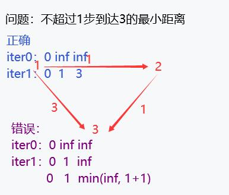

# 算法基础课

<!-- 一个史诗级算法学习巨作🤣 -->
<!-- emo的夏0营er -->

.center {
  display: flex;
  justify-content: center;
  align-items: center;
}


**目录**

- [算法基础课](#算法基础课)
  - [CH1 基础算法](#ch1-基础算法)
    - [1.2 二分](#12-二分)
    - [1.3 高精度运算](#13-高精度运算)
    - [1.4 前缀和与差分](#14-前缀和与差分)
    - [1.5 双指针问题](#15-双指针问题)
    - [1.6 离散化](#16-离散化)
    - [1.7 区间合并](#17-区间合并)
  - [CH2 数据结构](#ch2-数据结构)
    - [2.1 单链表](#21-单链表)
    - [2.2 双链表](#22-双链表)
    - [2.3 栈](#23-栈)
    - [2.4 单调栈](#24-单调栈)
    - [2.5 单调队列](#25-单调队列)
    - [2.7 Trie树](#27-trie树)
    - [2.8 并查集](#28-并查集)
    - [2.9 KMP](#29-kmp)
    - [2.10](#210)
  - [CH3 搜索与图论](#ch3-搜索与图论)
    - [3.3 树与图的深度优先遍历](#33-树与图的深度优先遍历)
    - [3.4 树与图的广度优先遍历](#34-树与图的广度优先遍历)
    - [3.5 拓扑排序](#35-拓扑排序)
    - [3.6 dijkstra 算法](#36-dijkstra-算法)
    - [3.7 bellman-ford 算法](#37-bellman-ford-算法)
    - [3.8 spfa算法](#38-spfa算法)
    - [3.9 floyd 算法](#39-floyd-算法)
    - [3.10 prim 算法](#310-prim-算法)
    - [3.11 Kruskal算法](#311-kruskal算法)
    - [3.12 染色法判定二分图](#312-染色法判定二分图)
    - [3.13 匈牙利算法](#313-匈牙利算法)

---

## CH1 基础算法

### 1.2 二分

***二分思想：***
二分问题主要考虑是否具有某一特性能够将数据划分成左右两块，

- 使用`mid>=（边界值）`寻找左边界，
- 使用`mid<=（边界值）`寻找右边界，

需要注意的是判断当`l=r-1`时的边界取值，是否会导致`l=mid`一直成立，导致死循环

***模板：***

```cpp
while(q --)
{
    l = 0, r = n - 1;
    cin >> k;
    int mid;
    // 寻找左边界
    while(l < r)
    {
        mid = (l + r) >> 1;
        if(a[mid] >= k) r = mid;
        else l = mid + 1;
    }
    // while循环结束时，l == r
    if(a[l] != k)   // 不存在满足的值，第一个 > k 的数
    {
        cout << "-1 -1" << endl;
        continue;
    }
    cout << l << ' ';
    l = 0, r = n - 1, mid = 0;
    // 寻找右边界
    while(l < r)
    {
        // ---note：需要注意+1来避免死循环->l = r - 1时的情况---
        mid = (l + r + 1) >> 1;
        if(a[mid] <= k) l = mid;
        else r = mid - 1;
    }
    cout << r << endl;
}
```

1. [789. 数的范围](https://www.acwing.com/problem/content/791/)

我的解答：

```cpp
#include<iostream>

using namespace std;

const int N = 1e5 + 10;
int a[N];

int main()
{
    int n, k, l, r, q;
    cin >> n >> q;
    for(int i = 0; i < n; i ++)
    {
        cin >> a[i];
    }
    while(q --)
    {
        l = 0, r = n - 1;
        cin >> k;
        int mid;
        if(a[n - 1] < k || a[0] > k)
        {
            // printf("a[n - 1] = %d || a[0] = %d\n", a[n - 1], a[0]);
            cout << -1 << ' ' << -1 << endl;
            continue;
        }
        while(l < r)
        {
            mid = (l + r) >> 1;
            if(a[mid] >= k) r = mid;
            else l = mid + 1;
        }
        if(a[l] != k)
        {
            cout << "-1 -1" << endl;
            continue;
        }
        cout << l << ' ';
        l = 0, r = n - 1, mid = 0;
        while(l < r)
        {
            mid = (l + r + 1) >> 1;
            if(a[mid] <= k) l = mid;
            else r = mid - 1;
        }
        cout << r << endl;
    }
    return 0;
}
```

2. [790.数的三次方根](https://www.acwing.com/activity/content/11/)

主要是浮点数的二分，无整数二分时的左右边界考虑，只需更新左右边界即可

### 1.3 高精度运算

***高精度计算核心点：*** 用字符串保存数据，主要需要注意的是：***逆序保存中间计算的值***（将string类型转到int数组中，个位位于下标更小的地方）

***tips:***

- 在计算完成时对多余的前导0进行处理，使用`c.erase(c.begin())`或者`c.pop_back()`删除

### 1.4 前缀和与差分

***前缀和与差分互为逆运算：*** 对于使用差分的题目，前缀和可以还原取值，对于这个思想[二维差分](https://www.acwing.com/problem/content/800/)可以体现，这类题目有些绕，需要明白矩阵元素的含义，在写代码前，应该首先写出表达式，而后代码实现，这样效率更高

1. [二维差分](https://www.acwing.com/problem/content/800/)

我的解答：

```cpp
#include <iostream>

using namespace std;

const int L = 1e3 + 10;
int d[L][L];

void insert(int x1, int y1, int x2, int y2, int c)
{
    d[x1][y1] += c;
    d[x2 + 1][y2 + 1] += c;
    d[x1][y2 + 1] -= c;
    d[x2 + 1][y1] -= c;
}

int main()
{
    int n, m, q, x1, x2, y1, y2, tmp;
    cin >> n >> m >> q;
    for(int i = 1; i <= n; i ++)
    {
        for(int j = 1; j <= m; j ++)
        {
            cin >> tmp;
            insert(i, j, i, j, tmp);
        }
    }
    // for(int i = 1; i <= n; i ++)
    // {
    //     for(int j = 1; j <= m; j ++)
    //     {
    //         cout << d[i][j] << ' ';
    //     }
    //     cout << endl;
    // }
    while(q --)
    {
        cin >> x1 >> y1 >> x2 >> y2 >> tmp;
        insert(x1, y1, x2, y2, tmp);
    }
    for(int i = 1; i <= n; i ++)
    {
        for(int j = 1; j <= m; j ++)
        {
            d[i][j] += (d[i - 1][j] + d[i][j - 1] - d[i - 1][j - 1]);
            cout << d[i][j] << ' ';
        }
        cout << endl;
    }
}
```

### 1.5 双指针问题

***问题本质：*** 找到变量间单调的关系，将$O(n^2)$复杂度的问题转换为$O(n)$，避免暴力地遍历

**问题模板：**

```cpp
for(int i = 0; i < n; i ++)
{
    // 检查i和j不符合点，对j进行修改
    while(check())
    {
        // ……
    }

    // 问题的处理逻辑
}
```

1. [最长连续不重复子序列](https://www.acwing.com/problem/content/description/801/)

分析：j只会单调地向右移动，不会向左移动，因此具有双指针的特性

代码：

```cpp
#include <iostream>

using namespace std;

const int N = 1e5 + 10;
int a[N], b[N];

int main()
{
    int n;
    cin >> n;
    for(int i = 0; i < n; i ++) cin >> a[i];
    int j = 0, res = 0;
    for(int i = 0; i < n; i ++)
    {
        b[a[i]] ++;
        while(b[a[i]] > 1)
        {
            b[a[j]] --;
            j ++;
        }
        res = max(res, (i - j + 1));
    }
    cout << res << endl;
    return 0;
}
```

2. [数组元素的目标和](https://www.acwing.com/problem/content/802/)

分析：i只会递增，j只会递减

代码：

```cpp
#include <iostream>

using namespace std;

const int N = 1e5 + 10;
int a[N], b[N];

int main()
{
    int n, m, x;
    cin >> n >> m >> x;
    for(int i = 0; i < n; i ++) cin >> a[i];
    for(int i = 0; i < m; i ++) cin >> b[i];
    int j =  m - 1;
    for(int i = 0; i < n; i ++)
    {
        while(a[i] + b[j] > x) j --;
        if(a[i] + b[j] == x)
        {
            cout << i << ' ' << j << endl;
        }
    }
    return 0;
}
```

### 1.6 离散化

***算法思想：*** 考虑到有些数组会申请`很长的地址空间`，但是`只使用极少数的地址`，会导致很大的空间浪费，只将使用的地址映射到新的地址上，忽略未使用的地址，可以紧凑数组有用的空间

***实现方法：***

- 统计需要使用的地址，保存到一个数组中（称之地址数组，个人的叫法），排序并去重，方便使用二分查找目标地址的映射
- 使用新的一个数组（称之为数据数组，个人的叫法），保存需要的、有意义的数据，该数组的下标通过上面的映射数组得到
- 两个数组的联系在于，原先的数据存在数据数组中，原先的下标存在地址数组中，二者使用同一个下标

1. [区间和](https://www.acwing.com/problem/content/804/)

我的解答：

```cpp
#include <iostream>
#include <vector>
#include <algorithm>

using namespace std;

typedef pair<int, int> PII;
const int N = 3e5 + 10;
int item[N], sum[N];
vector<int> alls;               // 存储下标
vector<PII> add, query;

// 找到对应的下标——二分
int find(int index)
{
    int l = 0, r = alls.size() - 1;
    while(l < r)
    {
        int mid = (l + r) >> 1;
        if(alls[mid] >= index) r = mid;
        else l = mid + 1;
    }
    return l + 1;
}

int main()
{
    int n, m;
    cin >> n >> m;
    
    // 题目使用到的原数组下标
    int x, c;
    for(int i = 0; i < n; i ++)
    {
        cin >> x >> c;
        add.push_back({x, c});
        alls.push_back(x);
    }
    int l, r;
    for(int i = 0; i < m; i ++)
    {
        cin >> l >> r;
        query.push_back({l, r});
        alls.push_back(l);
        alls.push_back(r);
    }
    
    sort(alls.begin(), alls.end());
    alls.erase(unique(alls.begin(), alls.end()), alls.end());
    
    // for(int i = 0; i < alls.size(); i ++)
    //     cout << alls[i] << ' ';
    // cout << endl;
    
    // 进行加法操作
    int index = 0;
    for(int i = 0; i < add.size(); i ++)
    {
        item[find(add[i].first)] += add[i].second;
    }
    
    // 求前缀和
    for(int i = 1; i <= alls.size(); i ++)
        sum[i] = sum[i - 1] + item[i];
        
    // 求出区间的和
    for(int i = 0; i < query.size(); i ++)
    {
        int l = find(query[i].first);
        int r = find(query[i].second);
        cout << sum[r] - sum[l - 1] << endl;
    }
    
    return 0;
}
```

### 1.7 区间合并

本身没有难度，主要是一种处理的思想，具体解题思路如下：

- 按照区间左端点排序
- 此时区间之间的关系为以下三种情况，使用l，r标记一个连续的区间（因此再处理过程中需要更新）
  - 后一个区间包含在前一个区间之中->l，r保持不变
  - 后一个区间与前一个区间有交集，但不包含于前一个区间中->更新r
  - 后一个区间与前一个区间没有交集->将前一个连续区间保存起来，更新l，r的值
- 处理直至所有区间被检查完，将最后一个区间放入

我的解答：

```cpp
#include<iostream>
#include<vector>
#include<algorithm>

using namespace std;

typedef pair<int, int> PII;
vector<PII> pp;

int main()
{
    int n;
    cin >> n;
    int l, r;
    for(int i = 0; i < n; i ++)
    {
        cin >> l >> r;
        pp.push_back({l, r});
    }
    
    sort(pp.begin(), pp.end());
    
    vector<PII> res;
    l = pp[0].first, r = pp[0].second;
    for(int i = 1; i < pp.size(); i ++)
    {
        if(r < pp[i].first)
        {
            res.push_back({l, r});
            l = pp[i].first;
            r = pp[i].second;
        }
        else r = max(r, pp[i].second);
    }
    res.push_back({l, r});
    
    // for(int i = 0; i < res.size(); i ++)
    // {
    //     cout << res[i].first << ' ' << res[i].second << endl;
    // }
    
    cout << res.size() << endl;
    
    return 0;
}
```

> **小结：**
> 
> 终于刷完第一章了，虽然都是以前学过的一些算法，在小学期申请夏令营的生活里增加了一个新鲜劲，为面试机试做准备，加油！
> 
> 感谢西交计院发的入营offer，虽然不评优营，但是至少我还没被世界所抛弃

<div style="text-align: right;">
2023年6月25日&emsp;于长沙
</div>

---

## CH2 数据结构

### 2.1 单链表

对于单链表可以使用结构体（数据+指针）的方式保存。

但是动态分配很花时间（new&delete），于是使用数组模拟链表，用两个数组：数据数组和next数组，分别存储该节点数据和该节点下一节点下标，两个数组的关联在于下标，下标相同的两个数组元素对应于一个节点

**需要注意的是：** 由于性质是完成算法题，因此不考虑空间回收的问题，由此带来的好处是：下标为i - 1的数是第i个插入的数

相关的操作如下：

```cpp
#include<iostream>

using namespace std;

const int N = 1e5 + 10;
// e：数据数组   en：next下标数组   head：链表头   idx：下一待分配地址
int e[N], en[N], head, idx;

int main()
{
    int n;
    cin >> n;
    char op;
    head = -1;
    while(n --)
    {
        cin >> op;
        // 偷插操作
        if(op == 'H')
        {
            int m;
            cin >> m;
            en[idx] = head;
            head = idx;
            e[idx] = m;
            idx ++;
        }
        // 删除指定位置后一个
        else if(op == 'D')
        {
            int k;
            cin >> k;
            // 删除头节点
            if(k == 0)
            {
                head = en[head];
            }
            // 删除普通节点
            else
            {
                en[k - 1] = en[en[k - 1]];
            }
        }
        // 在指定位置后一个插入
        else if(op == 'I')
        {
            int k, x;
            cin >> k >> x;
            e[idx] = x;
            en[idx] = en[k - 1];
            en[k - 1] = idx;
            idx ++;
        }
    }
    
    // for(int i = 0; i < 10; i ++)
    //     cout << e[i] << ' ';
    // cout << endl;
    // for(int i = 0; i < 10; i ++)
    //     cout << en[i] << ' ';
    // cout << endl;
    
    int pos = head;
    while(pos != -1)
    {
        cout << e[pos] << ' ';
        pos = en[pos];
    }
    return 0;
}
```
1. [826. 单链表](https://www.acwing.com/problem/content/828/)

代码如上

### 2.2 双链表

与单链表类似使用数组存储

但是需要考虑节点左右的情况，与单链表不同，使用左右邻居数组，0号位指向头，1号位作为尾，不再使用head指向头

实现如下：

```cpp
#include<iostream>

using namespace std;

const int N = 1e5 + 10;
int e[N], l[N], r[N], idx, head;

void init()
{
    idx = 2;
    l[1] = 0;
    r[1] = -1;
    l[0] = -1;
    r[0] = 1;
    head = -1;
}

// 在第k个插入的数后插入x
void add(int k, int x)
{
    e[idx] = x;
    l[idx] = k;
    r[idx] = r[k];
    l[r[k]]= idx;
    r[k] = idx;
    idx ++;
}

// 将第k个插入的数删除
void delete_(int k)
{
    r[l[k]] = r[k];
    l[r[k]] = l[k];
}

int main()
{
    int n;
    cin >> n;
    string op;
    init();
    while(n --)
    {
        cin >> op;
        if(op == "L")
        {
            int x;
            cin >> x;
            add(0, x);
        }
        else if(op == "R")
        {
            int x;
            cin >> x;
            add(l[1], x);
        }
        else if(op == "D")
        {
            int k;
            cin >> k;
            delete_(k + 1);
        }
        else if(op == "IL")
        {
            int k, x;
            cin >> k >> x;
            add(l[k + 1], x);
        }
        else if(op == "IR")
        {
            int k, x;
            cin >> k >> x;
            add(k + 1, x);
        }
    }
    
    // for(int i = 0; i < 10; i ++)
    //     cout << e[i] << ' ';
    // cout << endl;
    // for(int i = 0; i < 10; i ++)
    //     cout << l[i] << ' ';
    // cout << endl;
    // for(int i = 0; i < 10; i ++)
    //     cout << r[i] << ' ';
    // cout << endl;
    
    
    int pos = r[0];
    while(r[pos] != -1)
    {
        cout << e[pos] << ' ';
        pos = r[pos];
    }
    return 0;
}
```

1. [827. 双链表](https://www.acwing.com/problem/content/829/)

我的解答如上所示

### 2.3 栈

本节主要难点在于：计算字符串给出的算数表达式的值，主要注意栈的用法，及栈空的判断，主要使用while循环计算、求值

中缀表达式的计算方法如下：
- 设置两个栈，一个数字栈numStack，用于存储表达式中涉及到的数字，operatorStack用于存储表达式中涉及到的运算符
- 逐个字符分析表达式，直到全部字符都已分析完
若当前字符为数字，则判断是否后续字符也为数字，若为数字则进行拼接，直到下一个数字为运算符为止，此时将拼接好的多位数字压入数字栈中。（如果已经是最后一个字符则直接压入栈）
- 若当前字符为算数运算符
  - 如果运算符栈为空则直接压入栈中
  - 运算符不为空，则对运算符优先级进行判断
  - 如果当前运算符优先级大于等于栈顶运算符则直接压入栈中
  - 如果优先级低于栈顶运算符，则，从数字栈中取出两个数据，将当前栈顶运算符弹出进行运算，将结果压入数字栈中，将当前运算符压入运算符栈中。`(此步骤保障了运算符之间的优先级)`
- 此时数字与运算符都已经压入栈中，此时运算符栈中均为优先级相同的运算符，需要进行收尾操作，如果运算符栈不为空，则依次从数字栈中弹出两个数据，与当前栈顶的运算符进行运算。将结果压入数字栈中。最后数字栈中的数字就是所要求解的结果

1. [3302. 表达式求值](https://www.acwing.com/problem/content/3305/)

我的解答：

```cpp
#include<iostream>
#include<unordered_map>
#include<cstring>
#include<stack>

using namespace std;

stack<char> opstk;
stack<int> numstk;

// 每次只计算一个操作符
void eval()
{
    int b = numstk.top(); numstk.pop();
    int a = numstk.top(); numstk.pop();
    char op = opstk.top(); opstk.pop();
    if(op == '+') numstk.push(a + b);
    else if(op == '-') numstk.push(a - b);
    else if(op == '*') numstk.push(a * b);
    else if(op == '/') numstk.push(a / b);
}

int main()
{
    string str;
    cin >> str;
    unordered_map<char, int> pr = {{'+', 1}, {'-', 1}, {'*', 2}, {'/', 2}};
    for(int i = 0; i < str.size(); i ++)
    {
        // 数字
        if(isdigit(str[i]))
        {
            int num = 0, j = i;
            while(isdigit(str[j]))
            {
                num = num * 10 + str[j] - '0';
                j ++;
            }
            i = j - 1;
            numstk.push(num);
        }
        // (
        else if(str[i] == '(')
        {
            opstk.push(str[i]);
        }
        else if(str[i] == ')')
        {
            while(opstk.top() != '(')eval();
            opstk.pop();
        }
        // 运算符
        else
        {
            while(opstk.size() && opstk.top() != '(' && pr[opstk.top()] >= pr[str[i]]) eval();
            opstk.push(str[i]);
        }
    }
    while(opstk.size()) eval();
    cout << numstk.top() << endl;
    return 0;
}
```

### 2.4 单调栈

***核心思想：*** 构造一个栈，使得栈中的元素单调递增，因此栈顶即为该位之前不包含该位，所有数据的最大值

1. [830. 单调栈](https://www.acwing.com/problem/content/832/)

我的解答：

```cpp
#include <iostream>

using namespace std;

const int N = 1e5 + 10;
int stk[N], tt = 0;

int main()
{
    int n;
    cin >> n;
    int n1 = n;
    while(n --)
    {
        int a;
        cin >> a;
        while(tt && stk[tt] >= a) tt --;
        if(tt == 0) cout << -1 << ' ';
        else cout << stk[tt] << ' ';
        // 由于tt = 0用于判断是否不满足条件，因此从1开始存储
        stk[++tt] = a;
    }
    return 0;
}
```

### 2.5 单调队列

***核心思想：*** 与单调栈类似，但是使用队列的形式，适用于变化范围的数据求最大最小值，如滑动窗口

模板为：

```cpp
// a:存数据  q:存单调队列下标
int a[N], q[N];
// hh:队列头  tt:队列尾  n:数据数量  K:窗口大小
int hh, tt, n, k;
// 初始化
hh = 0, tt = -1;

for(int i = 0; i < n; i ++)
{
    // 处理队头删除
    if(hh <= tt && i - k + 1 > q[hh]) hh ++;
    
    // 处理队尾加入
    while(hh <= tt && a[q[tt]] >= a[i]) tt--;
    q[++ tt] = i;
    
    // 输出一直是hh，因为while会让其变为最大/最小的值的下标
    if(i >= k - 1) printf("%d ", a[q[hh]]);
}
```

1. [154. 滑动窗口](https://www.acwing.com/problem/content/156/)

我的解答：

```cpp
#include<iostream>

using namespace std;

const int N = 1e6 + 10;
int a[N], q[N];
int hh, tt, n, k;

int main()
{
    scanf("%d %d", &n, &k);
    for(int i = 0; i < n; i ++) scanf("%d", &a[i]);
    hh = 0, tt = -1;
    
    for(int i = 0; i < n; i ++)
    {
        // 处理队头删除
        if(hh <= tt && i - k + 1 > q[hh]) hh ++;
        
        // 处理队尾加入
        while(hh <= tt && a[q[tt]] >= a[i]) tt--;
        q[++ tt] = i;
        
        if(i >= k - 1) printf("%d ", a[q[hh]]);
    }
    
    printf("\n");
    
    hh = 0, tt = -1;
    for(int i = 0; i < n; i ++)
    {
        // 处理队头删除
        if(hh <= tt && i - k + 1 > q[hh]) hh ++;
        
        // 处理队尾加入
        while(hh <= tt && a[q[tt]] <= a[i]) tt--;
        q[++ tt] = i;
        
        // 由于while循环的作用，会使得hh变成最大的点
        if(i >= k - 1) printf("%d ", a[q[hh]]);
    }
    
    return 0;
}
```

### 2.7 Trie树

***算法思想：*** 将串的各个元素分别进行处理，构成一个树，加速匹配过程（按照每位元素的匹配）

1. [835. Trie字符串统计](https://www.acwing.com/activity/content/problem/content/883/)

我的解答：
```cpp
#include<iostream>

using namespace std;

const int N = 1e5 + 10;
// son记录每个节点连接情况
// cnt计数每个节点对于字符串数量
// idx记录新加入节点编号
int son[N][26], cnt[N], idx;
char op[2], str[N];

void myInsert(char* str)
{
    int p = 0;
    for(int i = 0; str[i]; i ++)
    {
        int tmp = str[i] - 'a';
        if(!son[p][tmp]) son[p][tmp] = ++ idx;
        p = son[p][tmp];
    }
    cnt[p] ++;
}

int myQuery(char* str)
{
    int p = 0;
    for(int i = 0; str[i]; i ++)
    {
        int tmp = str[i] - 'a';
        if(!son[p][tmp]) return 0;
        p = son[p][tmp];
    }
    return cnt[p];
}

int main()
{
    int n;
    scanf("%d", &n);
    while(n --)
    {
        scanf("%s %s", op, str);
        if(*op == 'I') myInsert(str);
        else if(*op == 'Q') printf("%d\n", myQuery(str));
    }
    return 0;
}
```

2. [143. 最大异或对](https://www.acwing.com/activity/content/problem/content/884/)

我的解答：
```cpp
#include <iostream>

using namespace std;

const int N = 1e5 + 10, M = 31 * 1e5 + 10;
int a[N], son[M][2], idx = 0;

void insert(int x)
{
    int p = 0;
    for(int i = 30; i >= 0; i --)
    {
        int t = x >> i & 1;
        if(!son[p][t])
        {
            son[p][t] = ++ idx;
        }
        p = son[p][t];
    }
}

int query(int x)
{
    int res = 0, p = 0;
    for(int i = 30; i >= 0; i --)
    {
        int t = !(x >> i & 1);
        if(son[p][t])
        {
            res += (1 << i);
            p = son[p][t];
        }
        else
        {
            p = son[p][!t];
        }
    }
    return res;
}

int main()
{
    int n;
    cin >> n;
    
    for(int i = 0; i < n; i ++)
    {
        cin >> a[i];
        insert(a[i]);
    }
    
    int res = 0;
    for(int i = 0; i < n; i ++)
        res = max(res, query(a[i]));

    cout << res << endl;
    
    return 0;
}
```


### 2.8 并查集

该种算法用于快速的集合操作：①将两个集合合并②判断两个元素是否在一个集合中

算法思想：一个集合中所有元素以一个节点作为根，所有元素保存父节点的值，递归判断根是否相等以判断是否在一个集合中

改进：在查找时，将父节点直接指向根，减少对树的遍历

操作：
- 查找根：递归地查找
    ```cpp
    int find(int x)
    {
        // p数组保存父节点值，初始化为x，即自己，集合只有自己
        if(p[x] != x) p[x] = find(p[x]);
        return p[x];
    }
    ```
- 合并集合：将一个集合根的父节点指向另一个集合的根
    ```CPP
    int paa, pbb;
    paa = find(aa);
    pbb = find(bb);
    if(paa == pbb) continue;    // 不进行处理，aa于bb本就是一个集合中的结点
    p[paa] = pbb;               // 将aa作为bb的子节点
    // 记录根节点对应集合节点数量，初始化为1
    cnt[pbb] += cnt[paa];
    ```
- 判断是否在一个集合
    ```cpp
    if(find(aa) == find(bb))    // aa与bb在一个集合中
    else if(find(aa) != find(bb))   // aa与bb不在一个集合中
    ```

1. [836. 合并集合](https://www.acwing.com/problem/content/838/)

我的解答：
```cpp
#include<iostream>

using namespace std;

const int N = 1e5 + 10;
int p[N];
int n, m;

int find(int x)
{
    if(p[x] != x) p[x] = find(p[x]);
    return p[x];
}

// void print()
// {
//     for(int i = 1; i <= n; i ++)
//         printf("%d ", p[i]);
//     printf("\n");
// }

int main()
{
    
    scanf("%d%d", &n, &m);
    
    for(int i = 1; i <= n; i ++) p[i] = i;
    
    char op[2];
    int aa, bb;
    while(m --)
    {
        scanf("%s%d%d", op, &aa, &bb);
        if(*op == 'M')
        {
            p[find(aa)] = find(bb);
            // print();
        }
        else if(*op == 'Q')
        {
            // printf("aa = %d, bb = %d\n", find(aa), find(bb));
            if(find(aa) == find(bb)) printf("Yes\n");
            else printf("No\n");
        }
    }
    return 0;
}
```

2. [837. 连通块中点的数量](https://www.acwing.com/problem/content/839/)

我的解答：
```cpp
#include<iostream>

using namespace std;

const int N = 1e5 + 10;
int p[N], cnt[N];
int n, m;

int find(int x)
{
    if(p[x] != x) p[x] = find(p[x]);
    return p[x];
}

void print()
{
    printf("\n---\n");
    for(int i = 1; i <= n; i ++)
        printf("%d ", p[i]);
    printf("\n");
    for(int i = 1; i <= n; i ++)
        printf("%d ", cnt[i]);
    printf("\n---");
}

int main()
{
    scanf("%d%d", &n, &m);
    
    for(int i = 1; i <= n; i ++)
    {
        p[i] = i;
        cnt[i] = 1;
    }
    
    char op[3];
    int aa, bb;
    while(m --)
    {
        scanf("%s", op);
        if(*op == 'C')
        {
            scanf("%d%d", &aa, &bb);
            int paa, pbb;
            paa = find(aa);
            pbb = find(bb);
            if(paa == pbb) continue;
            cnt[pbb] += cnt[paa];
            p[paa] = pbb;
        }
        else if(op[1] == '1')
        {
            scanf("%d%d", &aa, &bb);
            if(aa == bb)
            {
                printf("Yes\n");
                continue;
            }
            if(find(aa) == find(bb)) printf("Yes\n");
            else printf("No\n");
        }
        else
        {
            scanf("%d", &aa);
            // print();
            printf("%d\n", cnt[find(aa)]);
        }
    }
    return 0;
}
```

3. [240. 食物链](https://www.acwing.com/problem/content/242/)

我的解答：
```cpp

```

### 2.9 KMP
> 由于kmp算法理解有些难度，所以按照acwing网站进度写题写总结时，没有写感想，后面准备408数据结构遇到，再次学习才有更深入的理解

> 前缀：不包含最后一个字符的任意子串
> 
> 后缀：不包含第一个字符的任意子串

***核心点：***

在字符串匹配中，如果每次没匹配成功就退回（最朴素的想法，时间复杂度为$O(mn)$）到主串下一位置、模式串开始位置会导致不必要的匹配，因为在上一轮已经匹配的那部分，可能会有前缀和后缀相同，可以借助这个特点减少匹配轮数，加快匹配进度

如何快速找到最长的前缀和后缀呢？

引入ne数组，ne[j]记录模式串`p[0:j]`最大部分匹配子串长度，所以可以在一伦匹配失败后跳转到ne[j]继续和主串当前位置字符比较（可能会重复这个步骤）

那如何构造ne数组呢？

第一个位置初始为0表示不能再后退，ne数组前后元素的存在关联（设当前待求ne[i]，j为ne[i - 1]，初始化为0）：

- 若p[j + 1] == p[i]，表示可以延申，ne[i] = ne[i - 1] = j + 1
- 若p[j + 1] != p[i]，表示p[1:i - 1]不能采取对应的前缀、后缀，则需要j变为ne[j]，重复上一步

实现代码：
```cpp
// 构造next数组
for(int i = 2, j = 0; i <= n; i ++)
{
    // j -> 退无可退（j还暗示i-1是否和1位置匹配）     p[i] != p[j + 1] -> 不匹配
    // j 是ne[i - 1]的取值
    while(j && p[i] != p[j + 1]) j = nn[j];
    if(p[i] == p[j + 1]) j ++;
    nn[i] = j;
}
```

使用ne部分匹配数组，开始主串和模式串的匹配

**约定** ：i指向主串待匹配的字符，j指向模式串待匹配的字符

（可能算法描述不是很清楚，直接看代码清晰一些）
- 若p[j + 1] == s[i]，对应位置字符相等，i++，j++
- 否则，j = ne[j]，直至p[j + 1] == s[i]，或者i、j越界，模式串从头开始匹配

```CPP
// kmp查找过程
for(int i = 1, j = 0; i <= m; i ++)
{
    while(j && s[i] != p[j + 1]) j = nn[j];
    if(s[i] == p[j + 1]) j ++;
    if(j == n)
    {
        // 主串找到一个模式串所作的动作
        printf("%d ", i - j);
        j = nn[j];
    }
}
```

1. [831. KMP字符串](https://www.acwing.com/problem/content/833/)

算法模板，和上述分析一致

我的回答：

```cpp
#include<iostream>

using namespace std;

const int M = 1e6 + 10, N = 1e5 + 10;
char p[N], s[M];
// nn从1开始，表示1：i中最大部分匹配的长度
int nn[N];

int main()
{
    int n, m;
    scanf("%d%s%d%s", &n, p + 1, &m, s + 1);
    
    // 构造next数组
    for(int i = 2, j = 0; i <= n; i ++)
    {
        // j -> 退无可退（j还暗示i-1是否和1位置匹配）     p[i] != p[j + 1] -> 不匹配
        // j 是ne[i - 1]的取值
        while(j && p[i] != p[j + 1]) j = nn[j];
        if(p[i] == p[j + 1]) j ++;
        nn[i] = j;
    }
    
    // kmp查找过程
    for(int i = 1, j = 0; i <= m; i ++)
    {
        while(j && s[i] != p[j + 1]) j = nn[j];
        if(s[i] == p[j + 1]) j ++;
        if(j == n)
        {
            printf("%d ", i - j);
            j = nn[j];
        }
    }
    return 0;
}
```

### 2.10 

## CH3 搜索与图论

### 3.3 树与图的深度优先遍历

主要是深度优先遍历的使用，需要注意的是使用一维数组表示临界表，下面是其经典代码：

```cpp
/*
    important：
        链表插入时采用头插的方式
*/

// 初始化
int e[2 * C],           // 保存元素（值） 
    ne[2 * C],          // 保存下一个元素的下标
    h[2 * C],           // 保存第[下标]元素链表的第一个元素的下标
    idx = 1;            // 自增的下标，在加入元素时起作用

// 增加元素函数
void add(int ss, int dd){
    e[idx] = dd,        // 保存元素
    ne[idx] = h[ss],    // 头插，将新元素作为头，原先的头作为当前元素的next
    h[ss] = idx ++;     // 头指针，自增下标
}
```

1. [846. 树的重心](https://www.acwing.com/problem/content/848/)

我的解答：

在第一次写代码时，忽略了与已访问节点的比较，考虑不完善！！！

```cpp
#include<iostream>

using namespace std;

const int C = 1e5 + 10;
int e[2 * C], ne[2 * C], h[2 * C], idx = 1;
int ans = C, n, aa, bb;
bool flag[C];

// 邻接表一维数组表示法
void add(int ss, int dd){
    e[idx] = dd, ne[idx] = h[ss], h[ss] = idx ++;
}

int dfs(int t){
    flag[t] = true;
    int cnt = 0, hh = h[t], mmax = 0;
    while(hh != 0){
        if(!flag[e[hh]]){
            int tmp = dfs(e[hh]);
            mmax = max(mmax, tmp);
            cnt += tmp;
        }
        hh = ne[hh];
    }
    // 此处忘记处理max(mmax, n - 1 - cnt)
    // ans = min(ans, n - 1 - cnt);
    ans = min(ans, max(mmax, n - 1 - cnt));
    return cnt + 1;
}

int main(){
    scanf("%d", &n);
    for(int i = 1; i < n; i ++) {
        scanf("%d%d", &aa, &bb);
        add(aa, bb);
        add(bb, aa);
    }
    dfs(1);
    printf("%d", ans);
    return 0;
}
```

### 3.4 树与图的广度优先遍历

1. [AcWing 847. 图中点的层次](https://www.acwing.com/activity/content/problem/content/910/)

使用`memset(dd, -1, sizeof dd)`比单独的数组使用数组记录是否访问更好更简洁，某名的bug老是不对

我的解答：

```cpp
#include<iostream>
#include<queue>
#include<string.h>

using namespace std;

const int C = 1e5 + 10;
int h[C], ne[C], e[C], idx = 1;
int n, m, dd[C];

void add(int a, int b){
    e[idx] = b, ne[idx] = h[a], h[a] = idx ++;
}

int bfs(){
    memset(dd, -1, sizeof dd);
    queue<int> q;
    q.push(1);
    dd[1] = 0;
    
    while(!q.empty()){
        int t = q.front();
        q.pop();
        for(int i = h[t]; i != 0; i = ne[i]){
            int j = e[i];
            if(dd[j] == -1){
                dd[j] = dd[t] + 1;
                q.push(j);
            }
        }
    }
    
    return dd[n];
}

int main(){
    scanf("%d%d", &n, &m);
    while(m --){
        int a, b;
        scanf("%d%d", &a, &b);
        add(a, b);
    }
    printf("%d\n", bfs());
    // for(int i = 1; i <= n; i ++)
    //     printf("%d ", dd[i]);
    return 0;
}
```

### 3.5 拓扑排序

类似于BFS

```cpp
#include<iostream>

using namespace std;

const int C = 1e5 + 10;
int h[C], e[C], ne[C], idx = 1;
int d[C], q[C], qt, qh, n, m;


void add(int a, int b){
    e[idx] = b, ne[idx] = h[a], h[a] = idx ++;
}

bool topsort(){
    for(int i = 1; i <= n; i ++){
        if(d[i] == 0){
            q[qt ++] = i;
        }
    }
    
    while(qh <= qt){
        for(int i = h[q[qh]]; i != 0; i = ne[i]){
            d[e[i]] --;
            if(d[e[i]] == 0) q[qt ++] = e[i];
        }
        qh ++;
    }
    
    // printf("qt = %d\n", qt);
    if(qt == n) return true;
    return false;
}

int main(){
    scanf("%d%d", &n, &m);
    while(m --){
        int a, b;
        scanf("%d%d", &a, &b);
        add(a, b);
        d[b] ++;
    }
    
    if(topsort()){
        for(int i = 0; i < n; i ++) printf("%d ", q[i]);
    } else {
        printf("-1\n");
    }
    return 0;
}
```

### 3.6 dijkstra 算法

使用优先队列优化的dijkstra 算法，时间复杂度为$O(mlog_2n)$,m为边数，n为节点数

***debug***：需要注意使用stl时，会有冗余已经处理过点，需要跳过
```cpp
#include<iostream>
#include<queue>
#include<utility>
#include<vector>
#include<cstring>

using namespace std;

typedef pair<int, int> PII;

const int C = 1e6 + 10;
int e[C], ne[C], h[C], w[C], idx = 1;
int n, m, x, y, z;
int dis[C], st[C];
priority_queue<PII, vector<PII>, greater<PII>> q;

void add(int a, int b, int c){
    e[idx] = b, w[idx] = c, ne[idx] = h[a], h[a] = idx ++;
}

int dijkstra(){
    q.push({0, 1});
    
    while(q.size()){
        PII tt = q.top();
        q.pop();
        // nn = 2, dd = 2
        int nn= tt.second, dd = tt.first;
        // 重复问题
        if(st[nn]) continue;
        st[nn] = 1, dis[nn] = dd;
        for(int j = h[nn]; j != 0; j = ne[j]){
            // printf("与%d相连的节点%d，权重为%d\n", nn, e[j], w[j]);
            if(!st[e[j]] && dis[e[j]] > dd + w[j]){
                dis[e[j]] = dd + w[j];
                // printf("与%d相连的节点%d，权重为%d，距离小，开始调整至%d\n", nn, e[j], w[j], dis[e[j]]);
                q.push({dis[e[j]], e[j]});
            }
        }
    }
    
    // for(int i = 1; i <= n; i ++)
    //     printf("%d ", dis[i]);
    // printf("\n");
    
    if(dis[n] == 0x3f3f3f3f) return -1;
    return dis[n];
}

int main(){
    scanf("%d%d", &n, &m);
    memset(dis, 0x3f, sizeof dis);
    for(int i = 0; i < m; i ++){
        scanf("%d%d%d", &x, &y, &z);
        add(x, y, z);
    }
    printf("%d", dijkstra());
    return 0;
}
```

### 3.7 bellman-ford 算法

判断k次是否可以到达n点，可以到达输出最小值

遍历每个边，直至所有边都不再变化（松弛，最多n次，可以用来检查负权回路），计网距离矢量路由算法是其应用

***debug***：防止路径条数超过k，应该使用更新前的距离，避免出现如下情况

<div style="display: flex; justify-content: center; align-items: center;">
  
</div>

```cpp
#include<iostream>
#include<cstring>

using namespace std;

const int N = 510, M = 10010;

struct Edge{
    int a, b, w;
} edges[M];
int n, m, k, x, y, z, dis[N], backup[N];

int bellmanFord(){
    while(k --){
        // memmove(backup, dis, sizeof dis);
        memcpy(backup, dis, sizeof dis);
        for(int i = 0; i < m; i ++){
            dis[edges[i].b] = min(dis[edges[i].b], backup[edges[i].a] + edges[i].w);
        }
    }
    
    // for(int i = 1; i <= n; i ++) printf("%d ", dis[i]);
    // printf("\n");
    
    if(dis[n] >= 0x3f3f3f3f / 2) printf("impossible");
    else printf("%d", dis[n]);
    return 0;
}

int main(){
    memset(dis, 0x3f, sizeof dis);
    scanf("%d%d%d", &n, &m, &k);
    for(int i = 0; i < m; i ++){
        scanf("%d%d%d", &x, &y, &z);
        edges[i] = {x, y, z};
    }
    dis[1] = 0;
    bellmanFord();
    return 0;
}
```

### 3.8 spfa算法

spfa算法是在bellman-ford算法基础上进行的优化，只对dis距离减小的点进行更新，减小复杂度

算法复杂度为：最坏： $O(nm)$，一般： $O(m)$

实现方式：使用队列保存dis减少的点，判断经过这个点dis是否减少，更新dis

***debug***:当值减小时，直接更新dis，看点是否队列中，不在则加入，否则不加入

1. [AcWing 851. spfa求最短路](https://www.acwing.com/problem/content/853/)

```cpp
#include<iostream>
#include<queue>
#include<cstring>

using namespace std;

const int C = 1e5 + 10;
int h[C], e[C], w[C], ne[C], idx = 1;
int m, n, x, y, z;
int dis[C], st[C];

void add(int a, int b, int c){
    e[idx] = b, w[idx] = c, ne[idx] = h[a], h[a] = idx ++;
}

void spfa(){
    memset(dis, 0x3f, sizeof dis);
    
    // 队列中保存距离变小的点，只需要更新这些点，某一点可以多次出入队列
    queue<int> q;
    q.push(1);
    dis[1] = 0;
    st[1] = 1;          // st用于描述点是否在队列中
    
    while(!q.empty()){
        int t = q.front();
        q.pop();
        st[t] = 0;
        
        for(int i = h[t]; i != 0; i = ne[i]){
            // 这里需要判断点是否在队列中嘛？
            // 判断：使得节点唯一但会使dis最小嘛？，不判断：可以某时刻dis最小
            // 重边->解决措施：若重边更小，直接更新dis
            if(dis[e[i]] > dis[t] + w[i]){
                dis[e[i]] = dis[t] + w[i];
                if(!st[e[i]]){
                    q.push(e[i]);
                    st[e[i]] = 1;
                }
            }
        }
    }
    
    if(dis[n] > 0x3f3f3f3f / 2) printf("impossible");
    else printf("%d", dis[n]);
}

int main(){
    scanf("%d%d", &n, &m);
    for(int i = 0; i < m; i ++){
        scanf("%d%d%d", &x, &y, &z);
        add(x, y, z);
    }
    
    spfa();
    
    return 0;
}
```

2. [AcWing 852. spfa判断负环](https://www.acwing.com/problem/content/854/)

在spfa的基础上修改：
1. 不初始化dis数组，理由为：

>假设有负环，那么负环上的点到虚拟源点0的距离一定是-INF对不对，因为我可以在负环上跑无限次，每次都能把我到0点的距离减小。然后因为边上的权值都是有限值，所以每次在负环上跑一圈就相当于dt[]减去一个有限值，最终dt[]==-INF，所以意味着会减无限次（简单明了的说就是我们在负环上跑无限次，就可以把我到0点的距离减成-INF）。重点来了，dt[]初值肯定是一个有限值，一个有限值每次减一个有限值（负环上跑一次），然后减无限次，最终dt[]减成-INF。即dt[]初值是多少都无所谓，因为会减无限次有限值，你再大的数减无限次有限值肯定减成-INF。我们只要用抽屉原理保证迭代超过n次的时候，说明路径上有起码n+1个点，说明有重复点，即有负环就行。所以我们甚至可以把判断条件改为cnt[j] > 99999都行，只要大于n。

2. 初始时把所有节点加入队列，理由为：

> 我们可以假设一个虚拟源点0点，从虚拟源点连一条权值是0的边到所有点，这样这个新图其实是和原图等价的（原图上有负环等价于新图上有负环），那我们做spfa的时候首先把0入队，第一次迭代的时候会把0出队，然后把和0点相连的点全部入队，那么就相当于把1-n的所有点入队，所有我们直接把所有点入队，效果是一样的，相当于自己手动迭代了一次spfa.

3. 增加 cnt 数组，记录最短路经过的边数，当边`>= n`时，根据鸽笼原理，有重复点，因此存在负回路

```cpp
#include<iostream>
#include<queue>

using namespace std;

const int C = 1e4 + 10, N = 2010;
int e[C], w[C], ne[C], h[C], idx = 1;
int n, m, x, y, z;
int dis[N], st[N], cnt[N];

void add(int a, int b, int c){
    e[idx] = b, w[idx] = c, ne[idx] = h[a], h[a] = idx ++;
}

bool check(){
    queue<int> q;
    for(int i = 1; i <= n; i ++){
        q.push(i);
        st[i] = 1;
    }
    
    while(!q.empty()){
        int t = q.front();
        q.pop();
        st[t] = 0;
        
        for(int i = h[t]; i != 0; i = ne[i]){
            if(dis[e[i]] > dis[t] + w[i]){
                dis[e[i]] = dis[t] + w[i];
                cnt[e[i]] = cnt[t] + 1;
                if(cnt[e[i]] >= n) return true;
                if(!st[e[i]]){
                    q.push(e[i]);
                    st[e[i]] = 1;
                }
            }
        }
    }
    
    return false;
}

int main(){
    scanf("%d%d", &n, &m);
    for(int i = 0; i < m; i ++){
        scanf("%d%d%d", &x, &y, &z);
        add(x, y, z);
    }
    
    if(check())printf("Yes");
    else printf("No");
    
    return 0;
}
```

### 3.9 floyd 算法

->动态规划<-

三层循环，i,j,k:从i到j的距离，经过k是否减小

1. [AcWing 854. Floyd求最短路](https://www.acwing.com/problem/content/856/)

TODO：
***debug:***最外层for循环的标志作为中转点，具体原因不太清楚

```cpp
#include<iostream>

using namespace std;

const int C = 210, INF = 1e9;
int d[C][C], n, m, q;

void floyd(){
    // 最外层for循环标志作为中转点
    for(int i = 1; i <= n; i ++){
        for(int j = 1; j <= n; j ++){
            for(int k = 1; k <= n; k ++){
                d[j][k] = d[j][k] > (d[j][i] + d[i][k]) ? (d[j][i] + d[i][k]) : d[j][k];
                // d[i][j] = d[i][j] > d[i][k] + d[k][j] ? d[i][k] + d[k][j] : d[i][j];
            }
        }
    }
}

void print(){
    for(int i = 1; i <= n; i ++){
        for(int j = 1; j <= n; j ++){
            printf("%d\t", d[i][j]);
        }
        printf("\n");
    }
}

int main(){
    scanf("%d%d%d", &n, &m, &q);
    
    for(int i = 1; i <= n; i ++){
        for(int j = 1; j <= n; j ++){
            if(i == j) d[i][j] = 0;
            else d[i][j] = INF;
        }
    }
    
    for(int i = 0; i < m; i ++){
        int a, b, c;
        scanf("%d%d%d", &a, &b, &c);
        d[a][b] = min(d[a][b], c);
    }
    
    floyd();
    print();
    
    while(q --){
        int a, b;
        scanf("%d%d", &a, &b);
        if(d[a][b] > INF / 2) printf("impossible\n");
        else printf("%d\n", d[a][b]);
    }
    
    return 0;
}
```

### 3.10 prim 算法

prim算法是基于点的贪心算法，每次选取距离集合距离最小的点，需要注意代码实现：
   
   1. 可能是非连通图
   2. 在负自环存在时，在更新dis时考虑后续对邻接矩阵的更新，可能会导致返回的最小生成树和变小

1. (AcWing 858. Prim算法求最小生成树)[https://www.acwing.com/problem/content/860/]

```cpp
#include<iostream>
#include<cstring>

using namespace std;

const int C = 510, INF = 0x3f3f3f3f;
int g[C][C], dis[C], n, m, u, v, w;
bool st[C];

// debug info:考虑负自环的影响
int prim(){
    int res = 0;
    for(int i = 1; i <= n; i ++){
        // 选出距离集合最小的点
        // 这个图可能是非连通图，因此需要每次选择一个，而非指定1在集合中
        int t = -1;
        for(int j = 1; j <= n; j ++){
            if(!st[j] && (t == -1 || dis[t] >= dis[j])){
                t = j;
            }
        }
        
        // 第一个被选中的点
        if(i == 1) dis[t] = 0;
        
        // 非连通图
        if(dis[t] == INF) return INF;
        
        st[t] = true;
        // 若没有处理负自环，需要将这句放于更新之前，因为后面for循环会修改dis值
        res += dis[t];
        
        for(int j = 1; j <= n; j ++){
            dis[j] = min(g[t][j], dis[j]);
        }
    }
    return res;
}

int main(){
    scanf("%d%d", &n, &m);
    memset(g, 0x3f, sizeof g);
    memset(dis, 0x3f, sizeof dis);
    for(int i = 0; i < m; i ++){
        scanf("%d%d%d", &u, &v, &w);
        g[u][v] = g[v][u] = min(g[u][v], w);
    }
    // 消除自环
    for(int i = 1; i <= n; i ++) g[i][i] = 0;
    
    int t = prim();
    if(t == INF) printf("impossible");
    else printf("%d", t);
    
    return 0;
}
```

### 3.11 Kruskal算法

以边为切入点，算法流程为：

1. 定义边的结构体，重载小于符号
2. 读入边，并排序
3. 遍历每条边，直至有 $n - 1$ 条边加入集合
   - 对于每条边，查找端点是否在一个集合中（使用并查集实现 $O(1)$ 复杂度）
   - 如果不在一个集合中，将端点加入集合

1. [AcWing 859. Kruskal算法求最小生成树](https://www.acwing.com/problem/content/861/)

***debug***:注意并查集书写

```cpp
#include<iostream>
#include<algorithm>

using namespace std;

const int C = 2e5 + 10;
int n, m, u, v, w;
int p[C];

struct edge{
    int a, b, w;
    
    bool operator<(const edge ee){
        return w < ee.w;
    }
} edges[C];

int find(int a){
    if(p[a] != a) p[a] = find(p[a]);
    return p[a];
}

int main(){
    scanf("%d%d", &n, &m);
    for(int i = 0; i < m; i ++){
        scanf("%d%d%d", &u, &v, &w);
        edges[i] = {u, v, w};
    }
    
    sort(edges, edges + m);
    
    for(int i = 0; i <= n; i ++) p[i] = i;
    
    int res = 0, cnt = 0;
    for(int i = 0; i < m; i ++){
        int a = edges[i].a, b = edges[i].b, c = edges[i].w;
        int pa = find(a), pb = find(b);
        if(pa != pb){
            p[pa] = pb;
            res += c, cnt ++;
        }
    }
    
    if(cnt != n - 1) printf("impossible");
    else printf("%d", res);
    
    return 0;
}
```

### 3.12 染色法判定二分图

算法流程：
对于所有点：

   1. 若该点未被染色，则染上1号色，将相邻的其他点，染成2号色，判断是否成功，若不成功则返回失败并退出，对相邻点重复此步骤，直至将这个连通块染色完成
   2. 若该点已被染色，则检查是否与想染的颜色一致，若不一致，则返回失败并退出

1. [染色法判定二分图](https://www.acwing.com/problem/content/862/)

```cpp
#include<iostream>

using namespace std;

const int N = 1e5 + 10, M = 2e5 + 10;
int e[M], ne[M], h[M], idx = 1;
int n, m, color[N];

void add(int a, int b){
    e[idx] = b, ne[idx] = h[a], h[a] = idx ++;
}

bool dfs(int i, int c){
    color[i] = c;
    for(int j = h[i]; j != 0; j = ne[j]){
        // 未着色
        if(!color[e[j]]){
            if(!dfs(e[j], 3 - c)) return false;
        }
        // 已着色
        else{
            if(color[e[j]] == c) return false;
        }
    }
    
    return true;
}

int main(){
    scanf("%d%d", &n, &m);
    for(int i = 1; i <= m; i ++){
        int u, v;
        scanf("%d%d", &u, &v);
        add(u, v);
        add(v, u);
    }
    
    bool flag = true;
    for(int i = 1; i <= n; i ++){
        if(!color[i]){
            if(!dfs(i, 1)){
                flag = false;
                break;
            }
        }
    }
    
    if(!flag) printf("No");
    else printf("Yes");
    return 0;
}
```

<!-- 还剩最后一题，加油💪，就要完成目标了 -->

### 3.13 匈牙利算法

算法流程（以男女匹配为例）：

1. 遍历每个男生，
   - 遍历他未遍历 & 所青睐的女生，若无男友，则选择他作为男友；若已有男友，则看之前男友是否有备选，若有备选，则女生选择这个男生作为男友，否则男生遍历下个女生，直至找到或者遍历完所有青睐的女生

参见代码注解

1. [二分图的最大匹配](https://www.acwing.com/problem/content/description/863/)

***debug:***在使用邻接表时，把e[j]写成了ne[j]老是过不了，很难受

```cpp
#include<iostream>
#include<cstring>

using namespace std;

const int N = 510, M = 1e5 + 10;
int e[M], ne[M], h[N], idx = 1;
int n1, n2, m, match[N];
bool st[N];

void add(int a, int b){
    e[idx] = b, ne[idx] = h[a], h[a] = idx ++;
}

bool find(int nn){
    for(int i = h[nn]; i != 0; i = ne[i]){
        int mm = e[i];
        if(!st[mm]){
            st[mm] = true;
            // 无男友 || 女生前男友可以找到备选，st告诉前男友为true的女生是我考虑过的或者考虑无果的
            if(match[mm] == 0 || find(match[mm]))
            {
                match[mm] = nn;
                return true;
            }
        }
    }
    return false;
}

int main(){
    scanf("%d%d%d", &n1, &n2, &m);
    for(int i = 0; i < m; i ++){
        int u, v;
        scanf("%d%d", &u, &v);
        add(u, v);
    }
    
    int res = 0;
    for(int i = 1; i <= n1; i ++){
        // st用于标记这个女生是否考虑过，需要标记让另一个人不要再选择这个女生
        memset(st, 0, sizeof st);
        if(find(i)) res ++;
    }
    
    printf("%d", res);
    return 0;
}
```

<!-- CH3 收尾，昨天计划完成CH3的，但是有个bug没想清楚，所以今天收尾 -->

<!-- 2023年9月14日：今天中山计院报名结束了，我也去联系了一个体系结构方向的老师，再amd就职过（职场经历丰富），方向我也很喜欢，但是感觉会被拒绝，希望可以过 -->